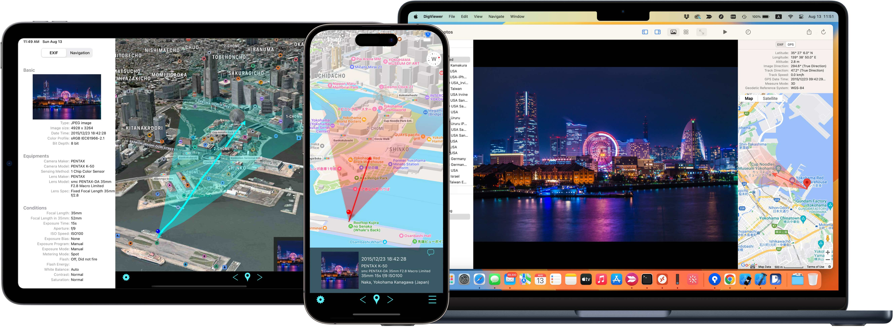

DigViewer
===



DigViewer is a photo viewer for Mac and it is designed for photographers who have a large volume of photo data and need to browse through them daily while confirming the data. 
It is designed with the fundamental philosophy of allowing comfortable and agile browsing of photos as well.<br>
This repository also includes codes of DigViewer remote which is a companion app for iOS device.

Regarding more detail information, please refer [the DigViewer official site](https://opiopan.github.io/DigViewer/).

## How to build for Mac
1. **Clone the repository then Build it**<br>
    ```shell
    $ git clone https://github.com/opiopan/DigViewer.git
    $ xcodebuild -project DigViewer/OSX/DigViewer.xcodeproj -target "Install Disk Image" -configuration Release
    ```

2. **Open disk image to install**<br>
    ```shell
    $ open DigViewer/OSX/build/Release/DigViewer.dmg
    ```

## How to build for iOS devices
There is a project bundle for iOS devices at [iOS/DigViewerRemote.xcodeproj](iOS/DigViewerRemote.xcodeproj/).
However, unlike the macOS case mentioned above, this project cannot be built as is.
This is because the build settings rely on information tied to my Apple ID. 

If you are building for iOS devices, please change the following settings to values associated with your Apple ID.
- ***Signing Team*** information
- ***Bundle Identifier***
- ***App Groups*** configured to facilitate the interaction between DigViewer remote itself and the four included actions within the application bundle 