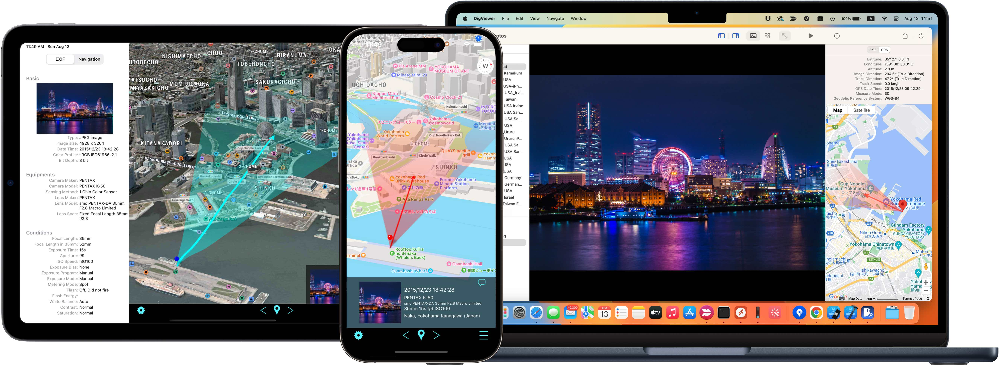
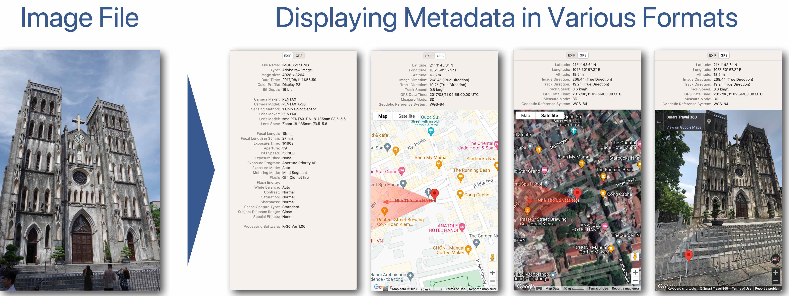

# Agile photo browsing
DigViewer is a photo viewer designed for photographers who have a large volume of photo data and need to browse through them daily while confirming the data.
It is designed with the fundamental philosophy of allowing comfortable and agile browsing of photos, and you can witness this through the following distinctive features.

* **Folder based architecture** 
    DigViewer does not create database or index files to manage photos. It displays the photos contained in the specified folders in their original folder structure. This approach is based on the empirical observation of the creater of DigViewer and their friends that those who regularly add many photos to their repositories find folder-based classification to be the most convenient.
    - [Keyboard shortcuts for browsing](shortcuts.md)
    - [Tips: Reducing opening folder time](reducing_time.md)
      

* **Utilization of embedded thumbnail** 
    Rendering RAW files can be a CPU-intensive task even on the latest Mac. RAW files and JPEG files output by digital cameras often include small-sized JPEG-format embedded thumbnail images within their metadata. DigViewer leverages these embedded thumbnail data for thumbnail mode and, depending on settings, for zoomed-in view as well. The embedded thumbnail data typically included by most digital cameras offer sufficient resolution and quality to preview the content and quality of the photo. 
    This feature becomes particularly beneficial when accessing repositories on slower storage mediums like NAS. Since metadata is located at the beginning of the file, this functionality allows rendering images for display without having to load the entire file.

* **Asynchronous loading and rendering** 
    In Thumbnail mode, the loading and rendering of image files are processed completely asynchronously from the user's interactions.
    This allows for smooth and responsive scrolling through folders containing files on NAS or large files, as well as swift navigation between folders.

# Displaying metadata
One of the advantages of digitizing photos is the ability to record the conditions under which they were taken as metadata, allowing for later review. This includes not only camera settings such as focal length, aperture value, and shutter speed, but also, as seen in smartphones, recording the location and direction of capture using built-in GPS and compass features. Even in DSLRs, camera manufacturers offer GPS attachments for retrofitting to record location information. 
DigViewer goes beyond simply displaying metadata recorded as EXIF data in numeric or textual form. It allows you to visualize and confirm the capture location, direction, and field of view on a map.
* [How to accurately correct lens information](correct_lens_info.md)

# Integration with iPhone and iPad
There is also a companion app named **DigViewer remote** available for iPhone and iPad. 
By pairing DigViewer with DigViewer remote, you can display the metadata of the photos being shown on your Mac on your iPhone or iPad 
as shown in the following demo video.  

    <iframe
        src="https://www.youtube.com/embed/t86bAb83PQM" 
        title="YouTube video player" frameborder="0" 
        allow="accelerometer; autoplay; clipboard-write; encrypted-media; gyroscope; picture-in-picture; web-share"
        allowfullscreen>
    </iframe>

Please download it from the App Store and give it a try.

    
    

# It's Open Source
DigViewer and DigViewre remote are developed as open source. Those source code is available on [the GitHub repository](https://github.com/opiopan/DigViewer). 
You are free to modify, redistribute, and use the code for commercial purposes within the scope of the license.
* [DigViewer GitHub repository](https://github.com/opiopan/DigViewer)

# Other information
* [DigViewer Privacy Policy](privacypolicy.md)
