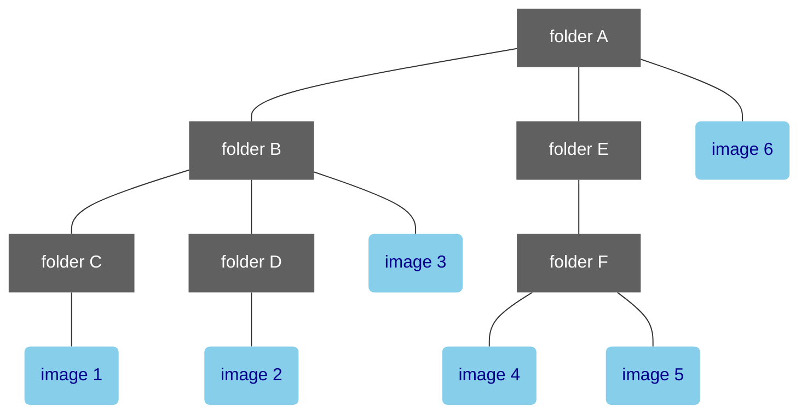

# Basic Concepts
DigViewer recursively scans the specified folder and lists all image files. 
These image files can be accessed in left pane of DigViewer according to the original directory structure.
On the other hand, when browsing images using keyboard shortcuts like arrow keys, 
you can treat all images as a one-dimensional list that spans across directory structures. 
This allows you to display all images sequentially or in reverse order, regardless of their original directories.

In this section, the behavior of commands like "Move to the next image" and "Move to the previous image" will be explained
using the example of a folder structure with six image files,　as shown in the diagram below.
Please note that the order of nodes at the same level is assumed to go from left to right in the diagram.

## How does DigViewer identify the next image and previous image
If the "Move to the next image" command is executed when the last image within a folder is selected, 
the application will ascend through the nodes in the parent direction until it finds a folder that is not the last node. 
If within the same folder of this identified folder, the next node is an image, it will be selected as the "next image". 
However, if the next node is a folder, the application will recursively descend through its children nodes and select the first image at the lowest level within that hierarchy.

In the case of the above diagram, the images from ***image 1*** to ***image 6*** are treated as a sequential list arranged in numerical order. The "Move to the next image" command will move to the image with the next higher number, while the "Move to the previous image" command will move to the image with the next lower number.

## How does DigViewer identify the next folder and previous folder
The algorithm for finding the next and previous folders is similar to that for images,
but the final step involving descending search for descendant nodes is not executed.

Here is a concrete example:
- The next folder of ***folder C*** is ***folder D***
- The next folder of ***folder D*** is ***folder E***
- The previous folder of ***folder F*** is ***folder B***
- The previous folder of ***folder E*** is ***folder B*** as well

# Global keyboard shortcuts
These shortcuts are available at all times regardless of DigViewer's display mode or keyboard focus position.

Keyboard shortcut            | Action
-----------------------------|----------------------
Shift + Right Arrow          | Move to the next image
Shift + Left Arrow           | Move to the previous image
Shift + Down Arrow           | Move to the next folder
Shift + Up Arrow             | Move to the previous folder
Command + Down Arrow         | Move to the first child node when the current node is a folder, Switch to single image mode when an image is selected in thumbnail mode
Command + Up Arrow           |Move to the parent folder when center pane is in thumbnail mode, Switch to thumbnail mode when center pane is in single image mode
Command + Enter              |Toggle the display mode of center pane between thumbnail mode and single image mode

# Contextual keyboard Shortcuts
These keyboard shortcuts are available only when the keyboard focus is on the central pane in single image view mode or on the left pane.

Keyboard shortcut            | Action
-----------------------------|----------------------
Right Arrow                  | Move to the next image
Left Arrow                   | Move to the previous image
